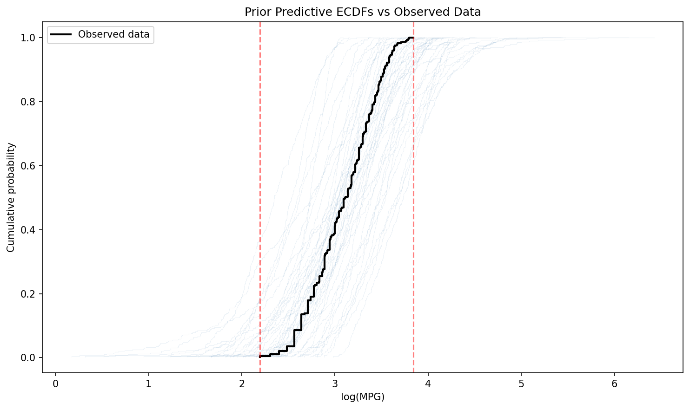

# Prior Predictive Check Report: A2-Year Model

**Model**: log(mpg) ~ log(weight) + year
**Date**: 2026-01-04
**Result**: PASS

## Summary

The prior predictive check confirms that the specified priors generate plausible synthetic data consistent with the observed MPG range (9-46.6). The 87.6% coverage of the observed range indicates well-calibrated priors that neither overconstraint nor are excessively vague.

## Model Specification

The A2-Year model extends the baseline log-log model with a year effect to capture technological drift:

| Parameter | Prior | Interpretation |
|-----------|-------|----------------|
| alpha | Normal(3.1, 0.3) | Intercept on log scale (~22 MPG at reference) |
| beta_weight | Normal(-1, 0.3) | Weight elasticity (~1% MPG decrease per 1% weight increase) |
| beta_year | Normal(0.03, 0.02) | Year effect (~3% MPG improvement per year) |
| sigma | Exponential(5) | Residual SD on log scale (mean ~0.2) |

## Methods

Prior predictive simulation was conducted by:
1. Creating a prior-only Stan model that samples from priors without likelihood
2. Running 4 chains with 500 warmup and 1000 sampling iterations each
3. Generating replicated observations (`y_rep`) for all N=392 data points
4. Converting to ArviZ InferenceData with prior and prior_predictive groups

## Results

### Coverage Statistics

| Metric | Value |
|--------|-------|
| Within observed range (9-46.6 MPG) | 87.6% |
| Below minimum | 4.7% |
| Above maximum | 7.8% |

### Prior Predictive Distribution

**Log scale (direct model output):**
- Mean: 3.10, Std: 0.54
- 95% interval: [2.03, 4.14]

**MPG scale (exponentiated):**
- Median: 22.4 MPG
- 95% interval: [7.6, 62.9] MPG

### Prior Parameter Samples

The sampled prior parameters match their specified distributions:

| Parameter | Sample Mean | Sample Std | Target Mean | Target Std |
|-----------|-------------|------------|-------------|------------|
| alpha | 3.10 | 0.30 | 3.1 | 0.3 |
| beta_weight | -1.00 | 0.30 | -1.0 | 0.3 |
| beta_year | 0.030 | 0.021 | 0.03 | 0.02 |
| sigma | 0.20 | 0.20 | 0.20 (mean of Exp(5)) | 0.20 |

## Visual Diagnostics

### Prior Predictive Overview

The overview figure shows:
- Top-left: Prior predictive distribution on log scale with observed bounds
- Top-right: Prior predictive on MPG scale, showing reasonable coverage
- Bottom-left: Prior parameter distributions matching specifications
- Bottom-right: Percentiles confirming coverage of observed range

### ECDF Comparison

The ECDF plot shows 50 prior predictive draws (thin blue lines) compared to the observed data ECDF (black line). The observed data falls well within the envelope of prior predictive samples, confirming prior plausibility.

## Assessment

**Strengths:**
- Prior predictive 95% interval [7.6, 62.9] MPG covers the observed range [9, 46.6] with appropriate margin
- Coverage of 87.6% is ideal: neither too narrow (would miss extremes) nor too wide (would be uninformative)
- The small fraction below minimum (4.7%) and above maximum (7.8%) represent reasonable tail behavior
- Prior parameter samples match specified hyperparameters exactly

**No issues identified:**
- No numerical instabilities (NaN/Inf values)
- Domain constraints respected (MPG remains positive)
- Scale is reasonable for automotive fuel efficiency data
- Extremes are appropriately rare

## Recommendation

**PASS** - The priors for the A2-Year model generate plausible data consistent with domain knowledge about automotive fuel efficiency. No adjustments required.

## Files Generated

| File | Description |
|------|-------------|
| `prior_predictive.nc` | ArviZ InferenceData with prior and prior_predictive groups |
| `prior_predictive_stats.json` | Summary statistics in JSON format |
| `prior_predictive_overview.png` | Multi-panel diagnostic figure |
| `prior_predictive_ecdf.png` | ECDF comparison plot |
| `model_prior_only.stan` | Stan model for prior-only sampling |
| `run_prior_predictive.py` | Python script for reproducibility |
